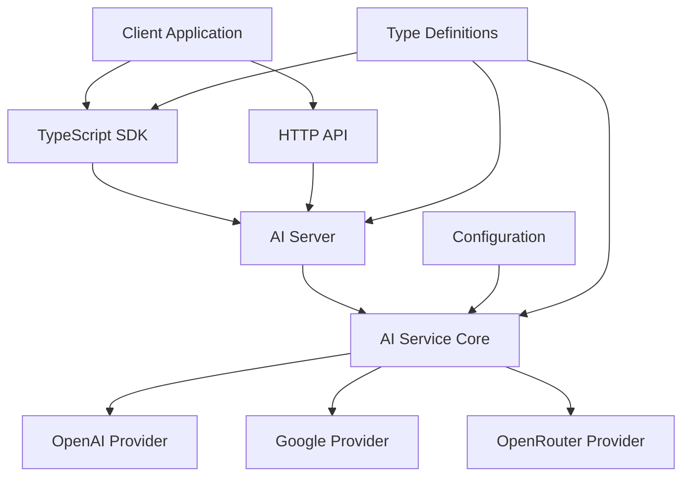

# AI API Service - Development Guide

## Table of Contents

- [Service Overview](#service-overview)
- [Architecture](#architecture)
- [Quick Start](#quick-start)
- [API Usage](#api-usage)
- [SDK Usage](#sdk-usage)
- [Development Setup](#development-setup)
- [Configuration](#configuration)
- [Integration Examples](#integration-examples)
- [Testing](#testing)
- [Deployment](#deployment)
- [Troubleshooting](#troubleshooting)

## Service Overview

The AI API Service is a unified interface for interacting with multiple AI providers (OpenAI, Google Generative AI, and Anthropic via OpenRouter) without managing provider-specific details. Built with Deno and TypeScript, it provides both HTTP REST endpoints and a TypeScript SDK for seamless integration.

### Key Features

- **Unified Interface**: Single API for multiple AI providers
- **Model Abstraction**: Friendly model names mapped to provider-specific identifiers
- **Dual Access Methods**: HTTP REST API and TypeScript SDK
- **Type Safety**: Full TypeScript support with comprehensive type definitions
- **Configuration Management**: Environment variable-based configuration
- **Error Handling**: Graceful error handling with meaningful messages
- **Health Monitoring**: Built-in health check endpoints
- **CORS Support**: Cross-origin resource sharing enabled
- **Structured Generation**: Support for both text and structured object generation

### Supported Providers

- **OpenAI**: GPT-4.1 series models
- **Google**: Gemini 2.5 series models  
- **Anthropic**: Claude 3.5 models (via OpenRouter)

## Architecture

### System Components



### Core Components

1. **AI Service Core** (`core/ai-service.ts`)
   - Abstracts provider-specific implementations
   - Manages model mappings and request formatting
   - Handles provider client initialization and management

2. **HTTP Server** (`server/server.ts`)
   - Exposes REST endpoints using Deno's native server
   - Handles request validation and response formatting
   - Provides CORS support and error handling

3. **SDK Client** (`sdk/client.ts`)
   - TypeScript client for direct integration
   - Handles HTTP communication and error handling
   - Provides timeout and retry mechanisms

4. **Configuration System** (`config/config.ts`)
   - Environment variable-based configuration
   - Provider and model mapping management
   - Validation and default value handling

5. **Type Definitions** (`types.ts`)
   - Shared TypeScript interfaces and types
   - Ensures consistency across all components

## Quick Start

### 1. Prerequisites

- Deno 2.3.6 or later
- At least one AI provider API key (OpenAI, Google, or OpenRouter)

### 2. Installation & Configuration

```bash
# Clone and navigate to the ai-api directory
cd internal/ai-api

# Copy environment configuration
cp .env.example .env

# Edit .env with your API keys
# At minimum, set one of:
# OPENAI_API_KEY=your-openai-key
# GOOGLE_GENERATIVE_AI_API_KEY=your-google-key
# OPENROUTER_API_KEY=your-openrouter-key
```

### 3. Start the Service

```bash
# Development mode (with file watching)
deno task dev

# Production mode
deno task start
```

The service will start on `http://localhost:8000` by default.

### 4. Using the SDK (Recommended)

The TypeScript SDK is the recommended way to interact with the AI API service:

```typescript
import { createSimpleClient } from "@scope/ai-api/client";

// Create client with default URL (http://localhost:8000)
const client = createSimpleClient();

// Generate text
const response = await client.generateText({
  messages: [
    { role: "user", content: "Hello, how are you?" },
  ],
  model: "gpt-4o",
});

console.log(response.content);

// Generate structured data
const structuredResponse = await client.generateObject({
  messages: [
    { role: "user", content: "Generate a person profile" }
  ],
  schema: {
    type: "object",
    properties: {
      name: { type: "string" },
      age: { type: "number" },
      occupation: { type: "string" }
    },
    required: ["name", "age", "occupation"]
  },
  model: "gpt-4o"
});

console.log(structuredResponse.object);
```

### 5. Alternative: Direct HTTP API

For non-TypeScript environments, you can use the HTTP API directly:

```bash
# Text generation
curl -X POST http://localhost:8000/generate \
  -H "Content-Type: application/json" \
  -d '{
    "messages": [
      {"role": "user", "content": "Hello, how are you?"}
    ],
    "model": "gpt-4o"
  }'

# Object generation
curl -X POST http://localhost:8000/generate-object \
  -H "Content-Type: application/json" \
  -d '{
    "messages": [
      {"role": "user", "content": "Generate a person profile"}
    ],
    "schema": {
      "type": "object",
      "properties": {
        "name": {"type": "string"},
        "age": {"type": "number"},
        "occupation": {"type": "string"}
      },
      "required": ["name", "age", "occupation"]
    },
    "model": "gpt-4o"
  }'
```

## API Usage

The AI API Service provides two ways to interact with it:

1. **TypeScript SDK (Recommended)**: Type-safe, easy-to-use client library
2. **HTTP REST API**: Direct HTTP calls for any programming language

### SDK Usage (Recommended)

The TypeScript SDK provides the most convenient and type-safe way to interact with the service:

```typescript
import { createSimpleClient } from "@scope/ai-api/client";

const client = createSimpleClient("http://localhost:8000");
```

### HTTP API (Alternative)

For non-TypeScript environments or direct HTTP access:

**Base URL:** `http://localhost:8000`
**Content Type:** `application/json`
**Authentication:** None (consider adding authentication for production)

### Response Format

All responses follow a consistent structure:

**Success Response:**
```json
{
  "success": true,
  "data": {
    // Response data here
  }
}
```

**Error Response:**
```json
{
  "success": false,
  "error": {
    "error": "Error message",
    "code": "ERROR_CODE",
    "details": {}
  }
}
```

### Available Operations

#### Text Generation

Generate text responses using AI models.

**SDK Usage (Recommended):**
```typescript
import { createSimpleClient } from "@scope/ai-api/client";

const client = createSimpleClient();

const response = await client.generateText({
  messages: [
    { role: "user", content: "Hello, how are you?" }
  ],
  model: "gpt-4o",
  maxTokens: 1000,
  temperature: 0.7
});

console.log(response.content);
console.log(`Used ${response.usage?.totalTokens} tokens`);
```

**HTTP API Alternative:**
```bash
curl -X POST http://localhost:8000/generate \
  -H "Content-Type: application/json" \
  -d '{
    "messages": [
      {"role": "user", "content": "Hello, how are you?"}
    ],
    "model": "gpt-4o",
    "maxTokens": 1000,
    "temperature": 0.7
  }'
```

**Response Format:**
```json
{
  "success": true,
  "data": {
    "content": "Hello! I'm doing well, thank you for asking...",
    "model": "gpt-4o",
    "usage": {
      "promptTokens": 10,
      "completionTokens": 15,
      "totalTokens": 25
    }
  }
}
```

#### Structured Object Generation

Generate structured objects using JSON schema validation.

**SDK Usage (Recommended):**
```typescript
import { createSimpleClient } from "@scope/ai-api/client";

const client = createSimpleClient();

// Define the expected structure
interface PersonProfile {
  name: string;
  age: number;
  occupation: string;
}

const response = await client.generateObject<PersonProfile>({
  messages: [
    { role: "user", content: "Generate a person profile" }
  ],
  schema: {
    type: "object",
    properties: {
      name: { type: "string" },
      age: { type: "number" },
      occupation: { type: "string" }
    },
    required: ["name", "age", "occupation"]
  },
  model: "gpt-4o"
});

console.log(response.object.name); // Type-safe access
console.log(`Used ${response.usage?.totalTokens} tokens`);
```

**HTTP API Alternative:**
```bash
curl -X POST http://localhost:8000/generate-object \
  -H "Content-Type: application/json" \
  -d '{
    "messages": [
      {"role": "user", "content": "Generate a person profile"}
    ],
    "schema": {
      "type": "object",
      "properties": {
        "name": {"type": "string"},
        "age": {"type": "number"},
        "occupation": {"type": "string"}
      },
      "required": ["name", "age", "occupation"]
    },
    "model": "gpt-4o"
  }'
```

**Response Format:**
```json
{
  "success": true,
  "data": {
    "object": {
      "name": "John Doe",
      "age": 30,
      "occupation": "Software Engineer"
    },
    "model": "gpt-4o",
    "usage": {
      "promptTokens": 25,
      "completionTokens": 12,
      "totalTokens": 37
    }
  }
}
```

#### Available Models

Get list of available AI models.

**SDK Usage (Recommended):**
```typescript
import { createSimpleClient } from "@scope/ai-api/client";

const client = createSimpleClient();

const models = await client.getModels();
console.log("Available models:", models);
// Output: ["gpt-4.1-nano", "gpt-4o", "gemini-2.5-flash", "anthropic/claude-3.5-sonnet"]
```

**HTTP API Alternative:**
```bash
curl http://localhost:8000/models
```

#### Health Check

Check service health and status.

**SDK Usage (Recommended):**
```typescript
import { createSimpleClient } from "@scope/ai-api/client";

const client = createSimpleClient();

const health = await client.getHealth();
console.log("Service status:", health.status);
console.log("Available models:", health.models);
console.log("Version:", health.version);
```

**HTTP API Alternative:**
```bash
curl http://localhost:8000/health
```

**Response Format:**
```json
{
  "success": true,
  "data": {
    "status": "healthy",
    "timestamp": "2024-01-01T00:00:00.000Z",
    "models": ["gpt-4.1-nano", "gpt-4o"],
    "version": "0.0.1"
  }
}
```

### Error Codes

- `GENERATION_ERROR`: Text or object generation failed
- `NOT_FOUND`: Endpoint not found
- `INTERNAL_ERROR`: Server error
- `VALIDATION_ERROR`: Request validation failed

## SDK Usage (Recommended)

The TypeScript SDK is the recommended way to interact with the AI API service. It provides type safety, better error handling, and a more convenient API.

### Installation

The SDK is included with the service. Import it directly:

```typescript
import { createSimpleClient, createClient, AIClient } from "@scope/ai-api/client";
import type {
  GenerateTextRequest,
  GenerateTextResponse,
  GenerateObjectRequest,
  GenerateObjectResponse
} from "@scope/ai-api/types";
```

### Basic Usage

#### Text Generation

```typescript
import { createSimpleClient } from "@scope/ai-api/client";

// Create client with default URL (http://localhost:8000)
const client = createSimpleClient();

// Generate text
const response = await client.generateText({
  messages: [
    { role: "user", content: "Explain quantum computing" }
  ],
  model: "gpt-4o",
  maxTokens: 500,
  temperature: 0.7
});

console.log(response.content);
console.log(`Used ${response.usage?.totalTokens} tokens`);
```

#### Structured Object Generation

```typescript
import { createSimpleClient } from "@scope/ai-api/client";

const client = createSimpleClient();

// Define the expected structure
interface ProductReview {
  rating: number;
  summary: string;
  pros: string[];
  cons: string[];
  recommended: boolean;
}

// Generate structured data
const response = await client.generateObject<ProductReview>({
  messages: [
    { role: "user", content: "Write a review for the iPhone 15" }
  ],
  schema: {
    type: "object",
    properties: {
      rating: { type: "number", minimum: 1, maximum: 5 },
      summary: { type: "string" },
      pros: { type: "array", items: { type: "string" } },
      cons: { type: "array", items: { type: "string" } },
      recommended: { type: "boolean" }
    },
    required: ["rating", "summary", "pros", "cons", "recommended"]
  },
  model: "gpt-4o"
});

console.log(`Rating: ${response.object.rating}/5`);
console.log(`Summary: ${response.object.summary}`);
console.log(`Recommended: ${response.object.recommended}`);
```

### Advanced Configuration

```typescript
import { createClient } from "@scope/ai-api/client";

// Full configuration options
const client = createClient({
  baseUrl: "https://your-ai-api.com",
  timeout: 60000 // 60 seconds
});

// Or use environment-specific URLs
const client = createSimpleClient(
  process.env.NODE_ENV === 'production'
    ? "https://api.yourcompany.com"
    : "http://localhost:8000",
  30000 // 30 second timeout
);

// Get available models
const models = await client.getModels();
console.log("Available models:", models);

// Check service health before making requests
const health = await client.getHealth();
if (health.status === "healthy") {
  console.log("Service is ready");
} else {
  console.warn("Service may be experiencing issues");
}
```

### Conversation Management

```typescript
import { createSimpleClient } from "@scope/ai-api/client";

const client = createSimpleClient();

// Build conversation context
const conversation = [
  { role: "system", content: "You are a helpful coding assistant." },
  { role: "user", content: "How do I create a REST API in TypeScript?" },
];

const response = await client.generateText({
  messages: conversation,
  model: "gpt-4o",
  maxTokens: 1000,
  temperature: 0.7
});

// Add response to conversation
conversation.push({ role: "assistant", content: response.content });

// Continue conversation
conversation.push({ role: "user", content: "Can you show me an example?" });

const followUp = await client.generateText({
  messages: conversation,
  model: "gpt-4o"
});
```

### Error Handling

```typescript
import { createSimpleClient } from "@scope/ai-api/client";

const client = createSimpleClient();

try {
  const response = await client.generateText({
    messages: [{ role: "user", content: "Hello" }],
    model: "invalid-model"
  });
} catch (error) {
  if (error.message.includes("Network error")) {
    console.error("Connection failed:", error.message);
    // Implement retry logic or fallback
  } else if (error.message.includes("timeout")) {
    console.error("Request timed out");
    // Consider increasing timeout or retrying
  } else if (error.message.includes("GENERATION_ERROR")) {
    console.error("AI generation failed:", error.message);
    // Handle provider-specific errors
  } else {
    console.error("Unexpected error:", error.message);
  }
}

// Error handling for object generation
try {
  const response = await client.generateObject({
    messages: [{ role: "user", content: "Generate invalid data" }],
    schema: { type: "object", properties: {} }
  });
} catch (error) {
  console.error("Object generation failed:", error.message);
  // Handle schema validation errors or provider issues
}
```

## Development Setup

### Prerequisites

- **Deno 2.3.6+**: [Install Deno](https://deno.land/manual/getting_started/installation)
- **API Keys**: At least one provider API key
- **Git**: For version control
- **Docker** (optional): For cross-platform compilation

### Local Development

1. **Clone the repository:**
   ```bash
   git clone <repository-url>
   cd internal/ai-api
   ```

2. **Set up environment:**
   ```bash
   cp .env.example .env
   # Edit .env with your API keys
   ```

3. **Install dependencies and start development server:**
   ```bash
   # Development mode with file watching
   deno task dev

   # Or start normally
   deno task start
   ```

4. **Verify installation:**
   ```bash
   curl http://localhost:8000/health
   ```

### Available Tasks

```bash
# Development with file watching
deno task dev

# Start production server
deno task start

# Run unit tests
deno task test

# Run tests with file watching
deno task test:watch

# Run end-to-end tests
deno task test:e2e

# Run all tests
deno task test:all
```

### Project Structure

```
internal/ai-api/
├── main.ts                 # Main entry point and exports
├── types.ts                # Shared type definitions
├── deno.json              # Deno configuration and dependencies
├── .env.example           # Environment configuration template
├── config/
│   ├── config.ts          # Configuration management
│   └── config_test.ts     # Configuration tests
├── core/
│   ├── ai-service.ts      # Core AI service implementation
│   └── ai-service_test.ts # AI service tests
├── server/
│   └── server.ts          # HTTP server implementation
├── sdk/
│   ├── client.ts          # SDK client implementation
│   └── client_test.ts     # SDK client tests
├── utils/
│   └── json-schema-to-zod.ts # JSON schema to Zod conversion
├── e2e/                   # End-to-end tests
│   ├── basic_providers.e2e.ts
│   ├── advanced_scenarios.e2e.ts
│   ├── custom_models.e2e.ts
│   └── utils/
├── docs/
│   └── DEPLOYMENT.md      # Deployment documentation
└── Dockerfile*            # Docker configurations
```

## Configuration

### Environment Variables

| Variable | Description | Required | Default |
|----------|-------------|----------|---------|
| `PORT` | Server port | No | `8000` |
| `HOST` | Server host | No | `0.0.0.0` |
| `OPENAI_API_KEY` | OpenAI API key | Conditional* | - |
| `OPENAI_BASE_URL` | OpenAI base URL | No | `https://api.openai.com/v1` |
| `OPENAI_DEFAULT_MODEL` | Default OpenAI model | No | `gpt-4.1-nano` |
| `GOOGLE_GENERATIVE_AI_API_KEY` | Google API key | Conditional* | - |
| `GOOGLE_BASE_URL` | Google base URL | No | Auto-configured |
| `GOOGLE_DEFAULT_MODEL` | Default Google model | No | `gemini-2.5-flash` |
| `OPENROUTER_API_KEY` | OpenRouter API key | Conditional* | - |
| `OPENROUTER_BASE_URL` | OpenRouter base URL | No | `https://openrouter.ai/api/v1` |
| `OPENROUTER_DEFAULT_MODEL` | Default OpenRouter model | No | `anthropic/claude-3.5-sonnet` |
| `AI_DEFAULT_MODEL` | Overall default model | No | `gpt-4.1-nano` |
| `AI_MODELS` | Custom model mappings (JSON) | No | - |

*At least one provider API key is required.

### Model Mappings

The service provides friendly model names that map to provider-specific identifiers:

**OpenAI Models:**
- `gpt-4.1-nano` → `gpt-4.1-nano` (default)
- `gpt-4.1-mini` → `gpt-4.1-mini`
- `gpt-4.1` → `gpt-4.1`
- `gpt-4o` → `gpt-4o`

**Google Models:**
- `gemini-2.5-flash-lite` → `gemini-2.5-flash-lite`
- `gemini-2.5-flash` → `gemini-2.5-flash`
- `gemini-2.5-pro` → `gemini-2.5-pro`

**Anthropic Models (via OpenRouter):**
- `anthropic/claude-3.5-sonnet` → `anthropic/claude-3.5-sonnet`
- `anthropic/claude-3.5-haiku` → `anthropic/claude-3.5-haiku`

### Custom Model Configuration

Define custom model mappings using the `AI_MODELS` environment variable:

```bash
AI_MODELS='[
  {
    "name": "my-custom-gpt",
    "provider": "openai",
    "modelId": "gpt-4",
    "isDefault": false
  },
  {
    "name": "my-claude",
    "provider": "openrouter",
    "modelId": "anthropic/claude-3.5-sonnet",
    "isDefault": true
  }
]'
```

## Integration Examples

### Web Application Integration

**Frontend (TypeScript with SDK - Recommended):**

```typescript
import { createSimpleClient } from "@scope/ai-api/client";

// Create AI service wrapper
class AIService {
  private client = createSimpleClient("http://localhost:8000");

  async generateText(prompt: string): Promise<string> {
    try {
      const response = await this.client.generateText({
        messages: [{ role: 'user', content: prompt }],
        model: 'gpt-4o',
        maxTokens: 500,
        temperature: 0.7
      });
      return response.content;
    } catch (error) {
      console.error('AI generation failed:', error);
      throw new Error('Failed to generate response');
    }
  }

  async generateStructuredData<T>(prompt: string, schema: any): Promise<T> {
    const response = await this.client.generateObject<T>({
      messages: [{ role: 'user', content: prompt }],
      schema,
      model: 'gpt-4o'
    });
    return response.object;
  }

  async getAvailableModels(): Promise<string[]> {
    return await this.client.getModels();
  }
}

// Usage in React component
const aiService = new AIService();

export function ChatComponent() {
  const [response, setResponse] = useState('');
  const [loading, setLoading] = useState(false);

  const handleSubmit = async (prompt: string) => {
    setLoading(true);
    try {
      const result = await aiService.generateText(prompt);
      setResponse(result);
    } catch (error) {
      console.error('Error:', error);
      setResponse('Sorry, something went wrong.');
    } finally {
      setLoading(false);
    }
  };

  return (
    <div>
      {/* Your UI components */}
      {loading ? 'Generating...' : response}
    </div>
  );
}
```

**Alternative: Direct HTTP API (for non-TypeScript environments):**

```javascript
// Using fetch API directly
async function generateText(prompt) {
  const response = await fetch('http://localhost:8000/generate', {
    method: 'POST',
    headers: {
      'Content-Type': 'application/json',
    },
    body: JSON.stringify({
      messages: [{ role: 'user', content: prompt }],
      model: 'gpt-4o',
      maxTokens: 500
    })
  });

  const result = await response.json();

  if (!result.success) {
    throw new Error(result.error?.error || 'Generation failed');
  }

  return result.data.content;
}
```

**Backend Service Integration:**

```typescript
import { createSimpleClient } from "@scope/ai-api/client";

class ChatService {
  private aiClient = createSimpleClient("http://ai-api:8000");

  async processUserMessage(userId: string, message: string): Promise<string> {
    try {
      const response = await this.aiClient.generateText({
        messages: [
          { role: "system", content: "You are a helpful assistant." },
          { role: "user", content: message }
        ],
        model: "gpt-4o",
        maxTokens: 1000,
        temperature: 0.7
      });

      // Log usage for monitoring
      console.log(`User ${userId} used ${response.usage?.totalTokens} tokens`);

      return response.content;
    } catch (error) {
      console.error(`Chat error for user ${userId}:`, error);
      throw new Error('Failed to process message');
    }
  }

  async generateStructuredData(prompt: string): Promise<any> {
    const schema = {
      type: "object",
      properties: {
        summary: { type: "string" },
        keyPoints: {
          type: "array",
          items: { type: "string" }
        },
        sentiment: {
          type: "string",
          enum: ["positive", "negative", "neutral"]
        }
      },
      required: ["summary", "keyPoints", "sentiment"]
    };

    const response = await this.aiClient.generateObject({
      messages: [{ role: "user", content: prompt }],
      schema,
      model: "gpt-4o"
    });

    return response.object;
  }
}
```

### Microservice Architecture

**Docker Compose Example:**

```yaml
version: '3.8'
services:
  ai-api:
    build: ./internal/ai-api
    ports:
      - "8000:8000"
    environment:
      - OPENAI_API_KEY=${OPENAI_API_KEY}
      - GOOGLE_GENERATIVE_AI_API_KEY=${GOOGLE_API_KEY}
      - PORT=8000
    healthcheck:
      test: ["CMD", "curl", "-f", "http://localhost:8000/health"]
      interval: 30s
      timeout: 10s
      retries: 3

  web-app:
    build: ./web-app
    ports:
      - "3000:3000"
    depends_on:
      - ai-api
    environment:
      - AI_API_URL=http://ai-api:8000
```

### Python Integration

**Note:** For TypeScript/JavaScript environments, use the SDK (shown above). For Python and other languages, use the HTTP API:

```python
import requests
import json
from typing import List, Dict, Any

class AIAPIClient:
    def __init__(self, base_url: str = "http://localhost:8000"):
        self.base_url = base_url.rstrip('/')

    def generate_text(self, messages: List[Dict[str, str]],
                     model: str = "gpt-4o",
                     max_tokens: int = 1000,
                     temperature: float = 0.7) -> Dict[str, Any]:
        """Generate text using the AI API."""
        payload = {
            "messages": messages,
            "model": model,
            "maxTokens": max_tokens,
            "temperature": temperature
        }

        response = requests.post(
            f"{self.base_url}/generate",
            json=payload,
            headers={"Content-Type": "application/json"}
        )

        response.raise_for_status()
        result = response.json()

        if not result.get("success"):
            raise Exception(result.get("error", {}).get("error", "Unknown error"))

        return result["data"]

    def get_models(self) -> List[str]:
        """Get available models."""
        response = requests.get(f"{self.base_url}/models")
        response.raise_for_status()
        result = response.json()

        if not result.get("success"):
            raise Exception("Failed to get models")

        return result["data"]["models"]

# Usage
client = AIAPIClient()

try:
    response = client.generate_text([
        {"role": "user", "content": "What is Python?"}
    ])
    print(f"Response: {response['content']}")
    print(f"Tokens used: {response.get('usage', {}).get('totalTokens', 'N/A')}")
except Exception as e:
    print(f"Error: {e}")
```

## Testing

### Test Structure

The AI API service includes comprehensive testing at multiple levels:

- **Unit Tests**: Test individual components in isolation
- **Integration Tests**: Test component interactions
- **End-to-End Tests**: Test complete workflows with mocked external APIs

### Running Tests

```bash
# Run unit tests
deno task test

# Run tests with file watching
deno task test:watch

# Run end-to-end tests
deno task test:e2e

# Run all tests
deno task test:all
```

### Writing Tests

**Unit Test Example:**

```typescript
import { assertEquals, assertThrows } from "@std/assert";
import { AIService } from "../core/ai-service.ts";
import type { ServiceConfig } from "../types.ts";

Deno.test("AIService - should validate request correctly", () => {
  const config: ServiceConfig = {
    port: 8000,
    host: "localhost",
    providers: [{ name: "openai", apiKey: "test-key" }],
    models: [{ name: "gpt-4", provider: "openai", modelId: "gpt-4" }],
    defaultModel: "gpt-4"
  };

  const service = new AIService(config);

  // Valid request should not throw
  service.validateRequest({
    messages: [{ role: "user", content: "Hello" }]
  });

  // Invalid request should throw
  assertThrows(() => {
    service.validateRequest({
      messages: [] // Empty messages array
    });
  });
});
```

**E2E Test Example:**

```typescript
import { describe, it, before, after } from "@std/testing/bdd";
import { assertEquals } from "@std/assert";
import { createSimpleClient } from "../sdk/client.ts";
import { startServer } from "../main.ts";

describe("E2E: Text Generation", () => {
  let server: any;
  let client: any;

  before(async () => {
    // Set up test environment
    Deno.env.set("OPENAI_API_KEY", "test-key");
    Deno.env.set("PORT", "8001");

    // Start server
    server = await startServer();
    client = createSimpleClient("http://localhost:8001");
  });

  after(async () => {
    await server.stop();
  });

  it("should generate text successfully", async () => {
    const response = await client.generateText({
      messages: [{ role: "user", content: "Hello" }],
      model: "gpt-4o"
    });

    assertEquals(typeof response.content, "string");
    assertEquals(response.model, "gpt-4o");
  });
});
```

### Test Configuration

Tests use environment variables for configuration. Create a `.env.test` file:

```bash
# Test environment configuration
OPENAI_API_KEY=test-openai-key
GOOGLE_GENERATIVE_AI_API_KEY=test-google-key
OPENROUTER_API_KEY=test-openrouter-key
PORT=8001
```

## Deployment

### Production Build

**Using Docker (Recommended):**

```bash
# Build for Linux
powershell -ExecutionPolicy Bypass -File build-linux.ps1

# Or build manually
docker build -f Dockerfile.prod -t ai-api:latest .
```

**Direct Compilation:**

```bash
# Compile to binary
deno compile --allow-net --allow-env --allow-read --output ai-api main.ts
```

### Docker Deployment

**Dockerfile.prod:**

```dockerfile
FROM denoland/deno:2.3.6

WORKDIR /app

# Copy source code
COPY . .

# Cache dependencies
RUN deno cache main.ts

# Expose port
EXPOSE 8000

# Run the application
CMD ["deno", "run", "--allow-net", "--allow-env", "--allow-read", "main.ts"]
```

**Docker Compose:**

```yaml
version: '3.8'
services:
  ai-api:
    build:
      context: .
      dockerfile: Dockerfile.prod
    ports:
      - "8000:8000"
    environment:
      - OPENAI_API_KEY=${OPENAI_API_KEY}
      - GOOGLE_GENERATIVE_AI_API_KEY=${GOOGLE_API_KEY}
      - OPENROUTER_API_KEY=${OPENROUTER_API_KEY}
      - PORT=8000
      - HOST=0.0.0.0
    restart: unless-stopped
    healthcheck:
      test: ["CMD", "curl", "-f", "http://localhost:8000/health"]
      interval: 30s
      timeout: 10s
      retries: 3
```

### Systemd Service

Create `/etc/systemd/system/ai-api.service`:

```ini
[Unit]
Description=AI API Service
After=network.target

[Service]
Type=simple
User=ai-api
WorkingDirectory=/opt/ai-api
ExecStart=/opt/ai-api/ai-api-linux
Restart=always
RestartSec=10
Environment=OPENAI_API_KEY=your-key
Environment=GOOGLE_GENERATIVE_AI_API_KEY=your-key
Environment=OPENROUTER_API_KEY=your-key
Environment=PORT=8000

[Install]
WantedBy=multi-user.target
```

```bash
sudo systemctl daemon-reload
sudo systemctl enable ai-api
sudo systemctl start ai-api
```

## Troubleshooting

### Common Issues

#### 1. Service Won't Start

**Error: "No AI providers configured"**

```bash
# Solution: Ensure at least one provider API key is set
export OPENAI_API_KEY="your-key-here"
# OR
export GOOGLE_GENERATIVE_AI_API_KEY="your-key-here"
# OR
export OPENROUTER_API_KEY="your-key-here"
```

**Error: "Port already in use"**

```bash
# Solution: Change the port or kill the process using it
export PORT=8001
# OR
lsof -ti:8000 | xargs kill -9
```

#### 2. API Request Failures

**Error: "Network error: Unable to connect"**

- Check if the service is running: `curl http://localhost:8000/health`
- Verify firewall settings
- Ensure correct base URL in client configuration

**Error: "Request timeout"**

```typescript
// Solution: Increase timeout in client configuration
const client = createSimpleClient("http://localhost:8000", 60000); // 60 seconds
```

**Error: "Generation failed" with provider errors**

- Verify API keys are correct and have sufficient credits
- Check provider-specific rate limits
- Ensure model names are valid

#### 3. Development Issues

**Error: "Module not found" during development**

```bash
# Solution: Clear Deno cache and reinstall dependencies
deno cache --reload main.ts
```

**Error: "Permission denied" errors**

```bash
# Solution: Ensure proper permissions are granted
deno run --allow-net --allow-env --allow-read main.ts
```

#### 4. Testing Issues

**E2E tests failing with network errors**

```bash
# Solution: Ensure test environment is properly configured
cp .env.example .env.test
# Edit .env.test with test API keys
deno task test:e2e
```

**Mock provider responses not working**

- Check that test mocks are properly configured
- Verify test environment variables are set
- Ensure test isolation between test cases

### Performance Optimization

#### 1. Response Time Optimization

```typescript
// Use appropriate model for your use case
const fastResponse = await client.generateText({
  messages: [{ role: "user", content: "Quick question" }],
  model: "gpt-4.1-nano", // Faster, cheaper model
  maxTokens: 100 // Limit response length
});
```

#### 2. Memory Usage

```bash
# Monitor memory usage
deno run --allow-net --allow-env --allow-read --v8-flags=--max-old-space-size=4096 main.ts
```

#### 3. Connection Pooling

The service automatically handles connection pooling for HTTP requests. For high-traffic scenarios, consider:

- Load balancing multiple service instances
- Implementing request queuing
- Using caching for repeated requests

### Monitoring and Logging

#### Health Check Monitoring

```bash
# Set up health check monitoring
curl -f http://localhost:8000/health || echo "Service is down"
```

#### Request Logging

```typescript
// Enable detailed logging in development
console.log("Request:", JSON.stringify(request, null, 2));
console.log("Response:", JSON.stringify(response, null, 2));
```

#### Error Tracking

```typescript
// Implement error tracking
try {
  const response = await client.generateText(request);
} catch (error) {
  // Log error details
  console.error("AI API Error:", {
    timestamp: new Date().toISOString(),
    request: request,
    error: error.message,
    stack: error.stack
  });

  // Report to monitoring service
  // reportError(error, { context: "ai-api-generation" });
}
```

### Getting Help

1. **Check the logs**: Service logs provide detailed error information
2. **Verify configuration**: Ensure all required environment variables are set
3. **Test connectivity**: Use health check endpoint to verify service status
4. **Review documentation**: Check provider-specific documentation for API limits and requirements
5. **Community support**: Refer to the project repository for issues and discussions

### Best Practices

1. **API Key Security**: Never commit API keys to version control
2. **Error Handling**: Always implement proper error handling in client code
3. **Rate Limiting**: Respect provider rate limits and implement backoff strategies
4. **Monitoring**: Set up health checks and monitoring for production deployments
5. **Testing**: Write comprehensive tests for your integrations
6. **Caching**: Implement caching for repeated requests to reduce costs
7. **Logging**: Log requests and responses for debugging and monitoring

---

For additional support and updates, refer to the project repository and documentation.
